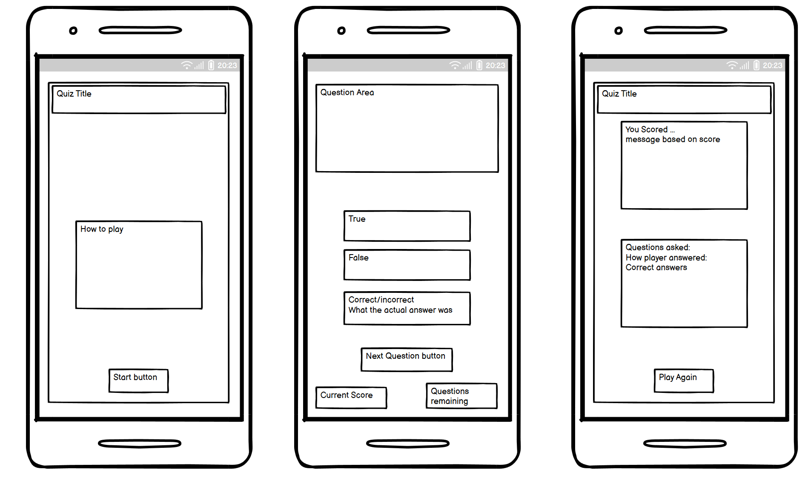
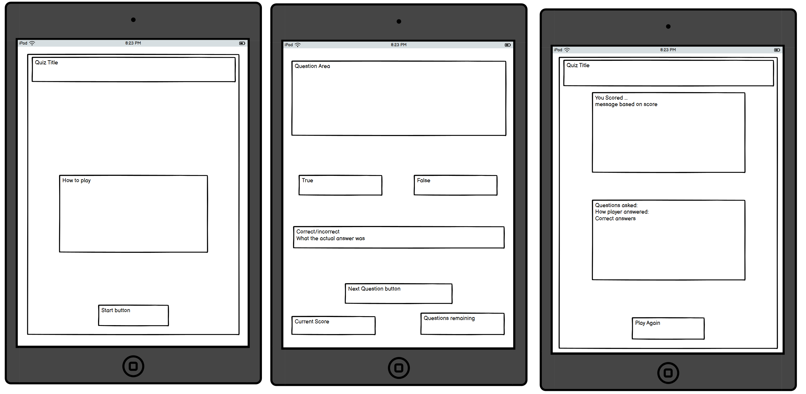
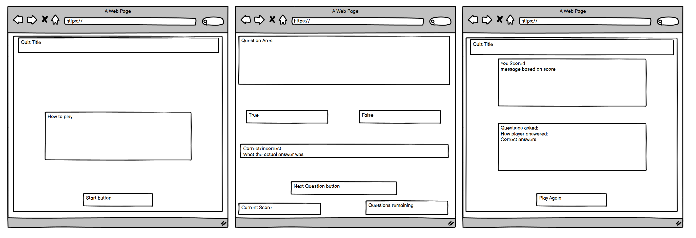
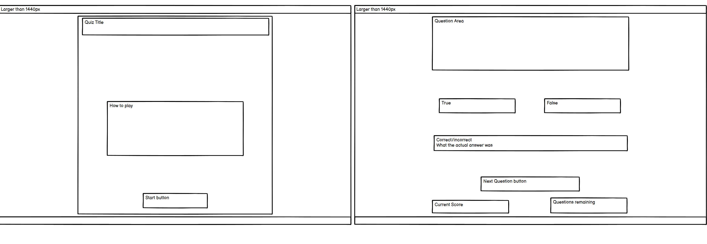
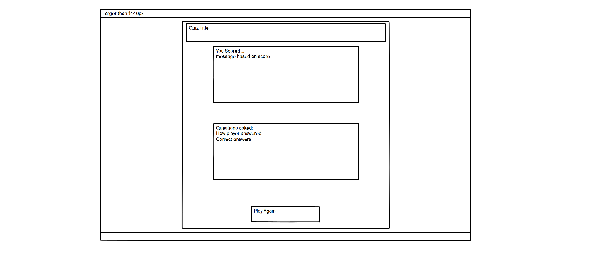
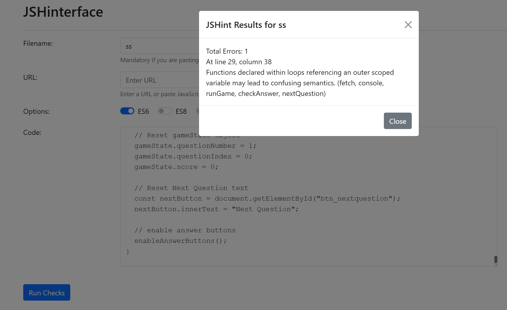

# Hackathon-1-Quiz-Game

 ***
HTML / CSS / JavaScript
***

 ***
 **| [MFS4711](https://github.com/MFS4711) |** **| [ajswanswick](https://github.com/ajswanwick) |** **| [Mery369](https://github.com/Mery369) |** **|  |** 
***

## Table of Contents

 1. [Overview](#overview)
     - [Purpose](#purpose)
     - [Target Audience](#target-audience)
 2. [User Stories](#user-stories)
     - [Must-Have User Stories](#must-have-user-stories)
     - [Should-Have User Stories](#should-have-user-stories)
     - [Could-Have User Stories](#could-have-user-stories)
 3. [Design Decisions](#design-decisions)
     - [Wireframes](#wireframes)
     - [Colours](#colours)
     - [Fonts](#fonts)
 4. [Features Implementation](#features-implementation)
     - [Core Features (Must-Haves)](#core-features-must-haves)
     - [Advanced Features (Should-Haves)](#advanced-features-should-haves)
     - [Optional Features (Could-Haves)](#advanced-features-should-haves)
 5. [Testing and Validation](#testing-and-validation)
     - [Testing Results](#testing-results)
     - [Validation](#validation)
 6. [Deployment](#deployment)
     - [Deployment Process](#deployment-process)
     - [File Structure](#file-structure)
 7. [AI Tools Usage](#ai-tools-usage)
     - [ChatGPT](#chatgpt)
 8. [Reflection on Development Process](#reflection-on-development-process)
 9. [Code Attribution](#code-attribution)
 10. [Future Improvements](#future-improvements)

## Overview

### Purpose
A brief description of the project's purpose, what it aims to achieve, and the value it provides to the users.  
**Guidance:** Begin filling out this section during Phase 1: Ideation & Initial Setup. Clearly articulate the main goal of your project, what it aims to achieve, and how it will provide value to your target audience.

### Target Audience
Identify the target audience for your website and explain why this audience will benefit from the project.  
**Guidance:** Use this section to identify who will benefit from your project and why. This should be informed by your user stories and overall project objectives.

## User Stories

### Must-Have User Stories

#### User Story 1
As a user, I want to be able to start a new quiz game so I can begin answering questions.

**Acceptance Criteria:**
- There is a clear "Start Game" button on the main screen.
- When clicked, the game begins, and the first question is displayed.
- The game interface should reset to default before starting a new game (i.e., score set to 0, timer reset).

#### User Story 2
In order to play the quiz as user, I can view the True and False question

**Acceptance Criteria:**
- The game displays one True or False question at a time.
- Each question includes the options "True" and "False."
- The question text is legible and properly formatted.

#### User Story 3
In order to play the quiz as a user, I can User can select True or False as the answer.

**Acceptance Criteria:**
- The user can click either the "True" or "False" button to select an answer.
- After selecting an answer, the button should visually indicate the choice (e.g., changing color or adding a checkmark).
- The game should immediately process the answer and provide feedback.

#### User Story 4
In order to play the game as a user, I can get different questions within the same session.

**Acceptance Criteria:**
- Questions are selected randomly from a database or predefined set.
- No question should be repeated within the same game session.

#### User Story 5
In order to play the game as a user, I can automatically end the game after a certain number of questions.

**Acceptance Criteria:**
- The game has a predefined number of questions (e.g., 10 questions).
- After all questions are answered, the game automatically ends.

#### User Story 6
In order to end the game and see my final score as a user, I can end the game manually and get a message of my final score.

**Acceptance Criteria:**
- The user can click an "End Game" button to end the game manually.
- The final score is displayed after ending the game.
- The user can see a message like “Game Over” along with the total score.

#### User Story 7
In order to know my score as a user, I can be updated in real time after each question.

**Acceptance Criteria:**
- The score increases by 1 for each correct answer.
- The score is displayed on the screen and updates in real-time after each question.

#### User Story 8
In order to have a feedback on my answer as a user, I can get an immediate message indicating if my answer is correct or incorrect.

**Acceptance Criteria:**
- After the user selects True or False, they receive immediate feedback indicating if their answer was correct or incorrect.
- The feedback should be displayed clearly (e.g., "Correct!" in green, "Incorrect!" in red).

### Should-Have User Stories

#### User Story 1
As a user, I want to have a countdown timer for each question soi can feel the pressure of time while answering

**Acceptance Criteria:**
* The timer counts down from a set time
* If the timer runs out, the answer is marked as incorrect
* the incorrect answer is added to the incorrect answers total

#### User Story 2
As a user, I want to know how many questions are remaining so I can pace myself.

**Acceptance Criteria:**
* The game displays the remaining amount of questions
* the remaining question total reduces after each question
* The visualisation is clear for the user

#### User Story 3
As a user, I want to be able to choose a category so i can play based on my interests or knowledge.

**Acceptance Criteria:**
*  the game provides the user with a selection of categories to choose from

#### User Story 4
As a user, I want to know how many correct answers I’ve gotten in a row to challenge myself to keep the streak going.

**Acceptance Criteria:**
* The game displays a counter which adds one for each correct answer
* The streak counter resets to zero when with an incorrect answer

#### User Story 5
As a user, I want to review the questions I answered incorrectly at the end of the game to learn from my mistakes.

**Acceptance Criteria:**
* The game displays the correct answer to the user

#### User Story 6
As a user, I want to see a leaderboard that shows the highest scores so I can compete with others.

**Acceptance Criteria:**
* create a table that logs users and their scores
* table displays scores in order from best to worst 

#### User Story 7
As a user, I want to have the option to play again right after finishing a game without having to navigate back to the main menu.

**Acceptance Criteria:**
* User can click a button at the end of the game to restart quiz
* the button should re-start quiz and not navigate to main menu 

#### User Story 8
As a user, I want an option to get a short explanation or hint for a tricky question if I'm unsure about the answer.

**Acceptance Criteria:**
* provide a hint or help button for the user
* the button displays a hint or solution

### Could-Have User Stories

#### User Story 1
In order to set how long I have to answer each question as a user, I can adjust the challenge level.

**Acceptance Criteria:**
* The user can choose a preferred timer duration (e.g., 15, 30, or 60 seconds).
* The timer adjusts based on the user’s selection before starting the game.

#### User Story 2
As a user, I want to choose my preferred difficulty level so I can tailor the quiz to my knowledge.

**Acceptance Criteria:**
* The user can select a difficulty level before starting the game (e.g., Easy, Medium, Hard).
* Questions should be appropriately harder or easier based on the selected level.

#### User Story 3
As a user, I want to earn rewards or badges for my performance to make the game more engaging and motivating.

**Acceptance Criteria:**
* The user can earn badges or rewards (e.g., "Streak Master" or "High Score").
* These rewards should be displayed on the results screen.

#### User Story 4
As a user, I want to share my score on social media to challenge friends to beat it.

**Acceptance Criteria:**
* The user can share their score directly to social media platforms (e.g., Facebook, Twitter).
* The shared post should include the user’s score and a link to the game.

#### User Story 5
As a user, I want to hear background music or sound effects to enhance the experience.

**Acceptance Criteria:**
* The game includes background music or sound effects during the quiz
* The user can toggle sounds on or off.

#### User Story 6
As a user, I want to be able to create a custom avatar or profile for my account

**Acceptance Criteria:**
* The user can create and customize their avatar (e.g., by choosing an image or icon).
* The avatar is displayed next to their score.

#### User Story 7
As a user, I want to see my past quiz scores over time so I can track my improvement.

**Acceptance Criteria:**
* The user can view a history of their past scores.
* The game stores and displays their top scores or performance over time.

#### User Story 8
As a user, I want a daily challenge feature that offers new questions and rewards to keep me coming back.

**Acceptance Criteria:**
* The user can participate in a "Daily Challenge" that offers unique questions or rewards.
* The challenge resets every day.

## Design Decisions

### Wireframes
Include wireframes for key sections of your website.  
Briefly describe the design choices, including layout, colour schemes, and fonts.  
**Guidance:** Start this section during Phase 1: Ideation & Initial Setup and update it throughout Phase 2 and Phase 3. Include digital wireframes created in Phase 1. Document the reasoning behind your layout choices, colour schemes, and font selections.

The Wireframes were produced during the ideation phase of this project. They were designed with the user in mind and to ensure the webpage was simplistic and functional as the purpose of the webpage is to provide a fun educational experience. The layout was constructed to make use of the space as the viewport grew up to a point, 1440px, and so the content appeared differently on mobiles compared to larger screens.

#### Mobile View

On a Mobile, it was the teams intention to open with a clear page displaying the webpage title, the instructions on how to play and a start button. This linear layout makes it easy for the user to follow along with the flow of the page. After clicking the start button, a new page appears which would be the game area. This contains a question at the top of the page, answer buttons in the middle with some feedback below and a score area. This provides the user all the information they need to play the quiz. Upon completing the quiz, the final score page will appear to provide a summary of the questions answered as well as the ability to play again.

A specific on Mobile to note is that the answer buttons will be displayed as blocks, one on top of the other.

#### Tablet View

This is very similar to the layout of the mobile view, the major difference being the appearance of the answer buttons. They will appear side by side to take up the space in the tablet view.

#### Desktop/Laptop View

This is very similar to the tablet view, the only difference being that the content is making more use of the space.

#### Larger Screens View

The layout follows the laptop view but there should be a container which stops the content growing at a certain point.

### Colours

#### Marian Blue  (#3D3B8E)
We chose this color as the maain theme colour throughout the page, it proves nice contrast to the background and fits 
in well with the theme of the quiz, for text and information boxes the colour is used with an opacity of 0.8 to allow the background image to be partly visible, this colour is used as a solid for buttons

#### Vermillion (#E53935)
This colour is used to provide the user with a clear visual indicator of questions remaing

#### Old gold (#CFB53B)
This colour is used to provide the user with a clear visual indicator of current correct answers in the questions 
page of the quiz

### General Colours
white and black were used in this project for some background colour and some border colour.

### Fonts
Quantico - google font was used throughout this project, it is clear easy to read and suits the theme and style of our mind mingle quiz. 

### Accessibility Considerations
Discuss how accessibility guidelines were adhered to, including colour contrast and alt text for images.  
**Guidance:** Outline how you've incorporated accessibility into your design, ensuring that your project adheres to guidelines such as WCAG.

#### Colour Contrast
The team ensured to adhere to accessibility guidelines by using the combinations of colours we picked. We used [Coolers Contrast Checker](https://coolors.co/contrast-checker/112a46-acc8e5) to examine the colours used during the project.  Below you will find the results of the various contrast checks we completed where we compared the background colour with the foreground content:

#### Screen Reader Accessibility

## Features Implementation

### Core Features (Must-Haves)
- **Feature 1:** Game Start: The "Start Game" button (User Story 1) initializes the game with a clean slate ensuring users can easily begin a new game. The score, question number, and API object is reset in the associated JavaScript.
- **Feature 2:** True/False Questions: Questions are randomly selected from the API and displayed one at a time (User Story 2, 4), allowing users to engage with different questions throughout the game session.
- **Feature 3:** Answer Selection: The "True" and "False" buttons (User Story 3) are interactive, providing users with a clear and visual way to select answers. Immediate feedback is provided, helping the user understand their performance after each question.
- **Feature 4:** Score Tracking: The score is updated in real time (User Story 7) after each correct answer, ensuring users know how they’re progressing throughout the game.
- **Feature 5:** End of Game: The game can end automatically after a fixed number of questions (User Story 5).
- **Feature 6:** Feedback: Users receive immediate feedback on their answers (User Story 8), reinforcing their understanding of correct and incorrect responses.

### Advanced Features (Should-Haves)
- **Feature 1:** Remaining Questions Display: Users are shown how many questions are remaining, helping them pace themselves (User Story 2).
- **Feature 2:** Review Incorrect Answers: Users can review their incorrect answers at the end of the game to learn from their mistakes (User Story 5).
- **Feature 3:** Play Again Option: A "Play Again" button allows users to restart the quiz without navigating to the main menu (User Story 7).

### Optional Features (Could-Haves)
These User Stories as well as some of the should-have user stories were not implemented primarily due to time constraints but also due to the current lack of the necessary skillset to design these aspects such as the personalisation aspect.

## Testing and Validation

### Testing Results
Summarize the results of testing across different devices and screen sizes.  
Mention any issues found and how they were resolved.  
**Guidance:** Summarize the results of your testing across various devices using tools like Chrome DevTools, as outlined in Phase 2. Mention any issues found and how they were resolved.

### Testing Results

#### Bug Fixes

#### Responsiveness

### Validation
Discuss the validation process for HTML and CSS using W3C and Jigsaw validators.  
Include the results of the validation process.  
**Guidance:** Document your use of W3C and Jigsaw validators to ensure your HTML and CSS meet web standards. Include any errors or warnings encountered and how they were resolved.

#### HTML Validation
HTML validation was achieved using the [W3C Validator](https://validator.w3.org/) which ensured the code met web standards.

#### CSS Validation
CSS validation was achieved using the [Jigsaw Validator](https://jigsaw.w3.org/css-validator/) which ensured the code met web standards.

#### JavaScript Validation
Although there was not a specific JavaScript validator for web standards, we used a version of [JSHint](https://mfs4711.github.io/jshint-api/) which was created during a walkthrough session in a previous Code Institute module. This suggested only one potential error when the code was input. A screenshot of this is shown below.

## Deployment

### Deployment Process

The project was deployed early in the process to GitHub Pages to ensure any issues encountered could be resolved quickly.
Before deploying the project, We ensured to code the basic structure in HTML and CSS, and some basic JavaScript to ensure everything was working in unison.
The project was deployed via GitHub Pages which was accessed via the settings in the project repository. 
This involved publishing the main branch and root directory which took a few minutes before completing.
The deployed project updated as required after each git push and few, if any, issues were encountered.

### File Structure
The root directory is structured in a way that is clear an organised. This is separated into an assets folder and the index.html file as well as this README.md file.

In the assets folder, the images folder has been split into clear, logical folders, each enclosing images to be applied to the location of the folder name. This is particularly important as there are a large number of images used in the project and so having a single image file would make it difficult to read. Also, in this way, the relative image file paths, included in the html, can be followed easily.

Further to this, as per convention, in the assets folder, along with the image folder, there is a styles folder, which contains all css stylesheets used. In this project there was only one used, however, if there were more these would be easily found here. The same is true for the scripts folder containing the javascript which is also found in the assets folder.

This file structure allows for easy navigation and reading for anyone attempting to read the code. 

## AI Tools Usage

### ChatGPT

ChatGPT was used to provide both coding support and during the ideation phase. First of all, it was used for brainstorming ideas and producing layout concepts. Further to this, it was used to generate many user stories which have been used in the development of this project. Furthermore, it was used, at times, to provide coding support to help identify the code which was causing a particular bug. Challenges with this AI software included the need to ask the right questions as it can take the topic in an unintended direction, therefore, it was important to keep on top of this. Further to this, ChatGPT can make mistakes which would be easy to overlook without knowledge of the coding concept. An example of this would be an issue faced when trying to pass information from one function into another. ChatGPT suggested calling a variable declared in one function in a different function which would not be possible as variables are block scoped. Therefore, whilst an AI tool such as this can provide great benefits in finding solutions to problems, it can just as easily confidently make mistakes which can be tough to catch.

## Reflection on Development Process

### Successes
Effective use of AI tools, including GitHub Copilot and DALL-E, and how they contributed to the development process.

### Challenges
Describe any challenges faced when integrating AI-generated content and how they were addressed.

### Final Thoughts
Provide any additional insights gained during the project and thoughts on the overall process.  
**Guidance:** Begin drafting reflections during Phase 1 and update throughout the project. Finalize this section after Phase 4. Highlight successes and challenges, particularly regarding the use of AI tools, and provide overall insights into the project.

This Hackathon Project was not only the first time this team worked together on a web-based development project, it was also the first time the team worked together as such, some time was spent understanding each others personalities as well as their strengths and weaknesses in relation to coding. Arguably without this inital time spent together it would have been more difficult to understand how to collaborate and we know going forward, if we were to work in the same team, it would only become easier.

In regards to the coding aspect, as this was our first collaborative project using gitHub, issues were faced when creating branches and merging, such that occassionally during a merge into the main, another team member's work was inadvertently affected. To ensure this was kept to a minimum, it was decided those working on similar parts of the code would complete a review of the pull request which may affect their work and any changes required would be notified in a constructive way. This resulted in reduced merge conflicts and inadvertant errors when coding as the project progressed.

In regards to the final product created, this has incorporated all the must-have user stories and some of the should-have. With the time limit for this project being only 2.5 days, some features initially intended to be incorporated could not. However, the final product is functioning and does act as a fun, simple, educational tool as per the purpose and target audience of this project.

## Code Attribution
Properly attribute any external code sources used in the project (excluding GitHub Copilot-generated code).  
**Guidance:** Document any external code sources used throughout the entire project, especially during Phase 2 and Phase 3. Exclude GitHub Copilot-generated code from attribution.

### Educational Sources
There were many sources used for educational purposes during the course of this project to not only aid in refreshing previous content covered in HTML, CSS and JavaScript, but also provided a platform to enhance our knowledge further.

Educational resources used include [Code Institute](https://codeinstitute.net/), [W3Schools](https://www.w3schools.com/) and [MDN Web Docs](https://developer.mozilla.org/en-US/).

Use of ChatGPT supported clarification of coding issues faced as well as providing suggestions for improvement.

### Image Sources

### Icons/Styles
- [Bootstrap v5.3](https://getbootstrap.com/docs/5.3/getting-started/introduction/)
- [Font Awesome](https://fontawesome.com/)

## Future Improvements
Briefly discuss potential future improvements or features that could be added to the project.  
**Guidance:** Reflect on potential enhancements that could be made to the project after Phase 4: Final Testing, Debugging & Deployment. These could be Could user story features you didn’t have time to implement or improvements based on testing feedback.

Due to time spent on bug and merge conflict fixes, we were unable to add some of the features related to the should-have user stories. This includes having a countdown timer for each question as well as creating a leaderboard. Further to this, it would have been fairly easy to add further categories and question types, however, these features, due to the issues experienced, could not feature in the product. Further to this, primarily due to a lack of the necessary skillset/experience in javascript, we were unable to add the personalisation aspect illustrated in the could-have user stories. 